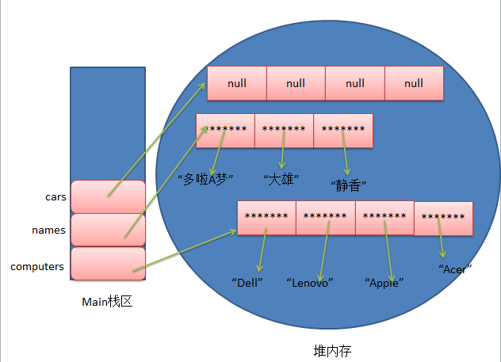
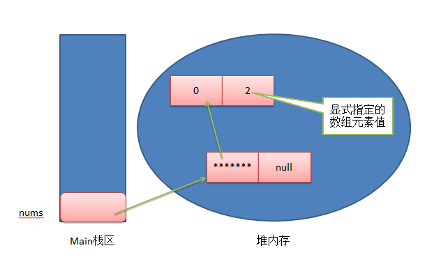

大部分情况，这是一场面试的开门题，面试官问这个问题，主要是考察你的概述能力和全局视野。有的人经常抱怨自己每天在堆业务，但没有成长。事实上，很多情况下确实在堆业务，但并不是没有成长的。并非做中间件或者技术架构才是成长，例如我们的需求分析能力，沟通协作能力，产品思维能力，抽象建模能力等都是一个非常重要的硬实力。

好的，现在进入正文。

1、明确项目是做什么的

2、明确项目的价值。（为什么做这个项目，它解决了用户什么痛点，它带来什么价值？）

3、明确项目的功能。（这个项目涉及哪些功能？）

4、明确项目的技术。（这个项目用到哪些技术？）

5、明确个人在项目中的位置和作用。（你在这个项目的承担角色？）

6、明确项目的整体架构。

7、明确项目的优缺点,如果重新设计你会如何设计。

8、明确项目的亮点。（这个项目有什么亮点？）

9、明确技术成长。（你通过这个项目有哪些技术成长？）

#### Java基础

##### 1、List 和 Set 的区别

##### 2、HashSet 是如何保证不重复的

##### 3、HashMap 是线程安全的吗，为什么不是线程安全的（最好画图说明多线程环境下不安全）?

##### 4、HashMap 的扩容过程

##### 5、HashMap 1.7 与 1.8 的 区别，说明 1.8 做了哪些优化，如何优化的？

##### 6、final finally finalize

##### 7、强引用 、软引用、 弱引用、虚引用

##### 8、Java反射

##### 9、Arrays.sort 实现原理和 Collection 实现原理

不论是Collections.sort方法或者是Arrays.sort方法，底层实现都是TimSort实现的，这是jdk1.7新增的，以前是归并排序。TimSort算法就是找到已经排好序数据的子序列，然后对剩余部分排序，然后合并起来

##### 10、LinkedHashMap的应用

LinkedHashMap是继承于HashMap，是基于HashMap和双向链表来实现的。

HashMap无序；LinkedHashMap有序，可分为插入顺序和访问顺序两种。如果是访问顺序，那put和get操作已存在的Entry时，都会把Entry移动到双向链表的表尾(其实是先删除再插入)。

LinkedHashMap存取数据，还是跟HashMap一样使用的Entry[]的方式，双向链表只是为了保证顺序。

LinkedHashMap是线程不安全的。

##### 11、cloneable接口实现原理
Java的克隆分为深克隆和浅克隆：

了解克隆clone我们必须要了解
1.首先，要了解什么是克隆，怎么实现克隆。
2.其次，你要大概知道什么是地址传递，什么是值传递。
3.最后，你要知道你为什么使用这个clone方法

Cloneable接口的作用：
    Object类中的clone()是protected的方法，在没有重写Object的clone()方法且没有实现Cloneable接口的实例上调用clone方法，会报CloneNotSupportedException异常。

    实现Cloneable接口仅仅是用来指示Object类中的clone()方法可以用来合法的进行克隆，即实现了Cloneable接口在调用Object的clone方法时不会再报CloneNotSupportedException异常。

clone方法：
    类在重写clone方法的时候，要把clone方法的属性设置为public。


为什么需要克隆？
   在实际编程过程中，会需要创建与已经存在的对象A的值一样的对象B，但是是与A完全独立的一个对象，即对两个对象做修改互不影响，这时需要用克隆来创建对象B。通过new一个对象，然后各个属性赋值，也能实现该需求，但是clone方法是native方法，native方法的效率一般远高于非native方法。
怎么实现克隆？
在要克隆的类要实现Cloneable接口和重写Object的clone()方法。

浅克隆
  对于Object类中的clone()方法产生的效果是：现在内存中开辟一块和原始对象一样的内存空间，然后原样拷贝原始对象中的内容。对基本数据类型来说，这样的操作不会有问题，但是对于非基本类型的变量，保存的仅仅是对象的引用，导致clone后的非基本类型变量和原始对象中相应的变量指向的是同一个对象，对非基本类型的变量的操作会相互影响。

结论：
1、克隆一个对象不会调用对象的构造方法。
2、clone()方法有三条规则：
(1)x.clone() != x; 
(2)x.clone().getClass() == x.getClass();
(3)一般情况下x.clone().equals(x); 
注意(3)不是必须要满足的。
3、对对象基本数据类型的修改不会互相影响，浅克隆对对象非基本数据类型的修改会相互影响，所以需要实现深克隆。

深克隆
  深克隆除了克隆自身对象，还对其非基本数据类型的成员变量克隆一遍。
深克隆的步骤：
1、首先克隆的类要实现Cloneable接口和重写Object的clone()方法。

2、在不引入第三方jar包的情况下，可以使用两种方法：
(1)先将对象进行序列化，紧接着马上反序列化 
(2)先调用super.clone()方法克隆出一个新对象，然后手动给克隆出来的对象的非基本数据类型的成员变量赋值。
  在数据结构比较复杂的情况下，序列化和反序列化可能实现起来简单，(2)实现比较复杂。经测试(2)会比(1)的执行效率高。

##### 12、异常分类以及处理机制

异常的分类：
 　Throwable是根接口。
 　Error和Exception继承这个接口 。
 　　Error是无法处理的异常，比如OutOfMemoryError，一般发生这种异常，JVM会选择终止程序。因此我们编写程序时不需要关心这类异常。
 　　Exception，也就是我们经常见到的一些异常情况，这些异常是我们可以处理的异常，是所有异常类的父类。
 　　RuntimeException和checked exception(受査异常也称非运行时异常)继承Exception
 　　unchecked Exception(非受査异常)，包括Error和RuntimeException，比如常见的NullPointerException、IndexOutOfBoundsException。对于RuntimeException，java编译器不要求必须进行异常捕获处理或者抛出  声明，由程序员自行决定。
 　　checked exception（受查异常），也称非运行时异常（运行时异常以外的异常就是非运行时异常），由代码能力之外的因素导致的运行时错误。java编译器强制程序员必须进行捕获处理，比如常见的有IOExeption  和SQLException。如果不进行捕获或者抛出声明处理，编译都不会通过。

处理机制:
 捕获机制：try-catch-finally
 try-监控区域，执行可能产生异常的代码
 catch-捕获，处理异常
 finally-善后处理，无论是否发生异常，代码总能执行

抛出异常：throw 手动抛出异常
 声明异常：throws 声明方法可能要抛出的异常
 throw：手动抛出异常，一般由程序员在方法内抛出Exception的子类异常。
 throws：声明在方法名之后，告诉调用者，该方法可能会抛出异常，也就是说异常发生后会抛给调用者，由 调用者处理异常。

请写出5种常见到的runtime exception
 常见的几种如下：
 NullPointerException - 空指针引用异常
 ClassCastException - 类型强制转换异常。
 IllegalArgumentException - 传递非法参数异常。
 ArithmeticException - 算术运算异常
 ArrayStoreException - 向数组中存放与声明类型不兼容对象异常
 IndexOutOfBoundsException - 下标越界异常
 NegativeArraySizeException - 创建一个大小为负数的数组错误异常
 NumberFormatException - 数字格式异常
 SecurityException - 安全异常
 UnsupportedOperationException - 不支持的操作异常

---

##### 13、wait和sleep的区别

java多线程是抢占式，而非分时制

1. 线程的挂起和唤醒
挂起实际上是让线程进入“非可执行”状态下，在这个状态下CPU不会分给线程时间片，进入这个状态可以用来暂停一个线程的运行；在线程挂起后，可以通过重新唤醒线程来使之恢复运行。
挂起的原因可能是如下几种情况：
（1）通过调用sleep()方法使线程进入休眠状态，线程在指定时间内不会运行。
（2）通过调用join()方法使线程挂起，使自己等待另一个线程的结果，直到另一个线程执行完毕为止。
（3）通过调用wait()方法使线程挂起，直到线程得到了notify()和notifyAll()消息，线程才会进入“可执行”状态。
（4）使用suspend挂起线程后，可以通过resume方法唤醒线程。
虽然suspend和resume可以很方便地使线程挂起和唤醒，但由于使用这两个方法可能会造成死锁，因此，这两个方法被标识为 deprecated（抗议）标记，这表明在以后的jdk版本中这两个方法可能被删除，所以尽量不要使用这两个方法来操作线程。
调用sleep()、yield()、suspend()的时候并没有被释放锁
调用wait()的时候释放当前对象的锁
wait()方法表示，放弃当前对资源的占有权，一直等到有线程通知，才会运行后面的代码。
notify()方法表示，当前的线程已经放弃对资源的占有，通知等待的线程来获得对资源的占有权，但是只有一个线程能够从wait状态中恢复，然后继续运行wait()后面的语句。
notifyAll()方法表示，当前的线程已经放弃对资源的占有，通知所有的等待线程从wait()方法后的语句开始运行。 

---

Java中的多线程是一种抢占式的机制，而不是分时机制。抢占式的机制是有多个线程处于可运行状态，但是只有一个线程在运行。 

**共同点**：
1. 他们都是在多线程的环境下，都可以在程序的调用处阻塞指定的毫秒数，并返回。 
2. wait()和sleep()都可以通过interrupt()方法 打断线程的暂停状态 ，从而使线程立刻抛出InterruptedException。 
      如 果线程A希望立即结束线程B，则可以对线程B对应的Thread实例调用interrupt方法。如果此刻线程B正在wait/sleep/join，则 线程B会立刻抛出InterruptedException，在catch() {} 中直接return即可安全地结束线程。 
      需要注意的 是，InterruptedException是线程自己从内部抛出的，并不是interrupt()方法抛出的。对某一线程调用 interrupt()时，如果该线程正在执行普通的代码，那么该线程根本就不会抛出InterruptedException。但是，一旦该线程进入到 wait()/sleep()/join()后，就会立刻抛出InterruptedException 。 

**不同点**： 
1.Thread类的方法：sleep(),yield()等 
Object的方法：wait()和notify()等 
2.每个对象都有一个锁来控制同步访问。Synchronized关键字可以和对象的锁交互，来实现线程的同步。 
sleep方法没有释放锁，而wait方法释放了锁，使得其他线程可以使用同步控制块或者方法。 
3.wait，notify和notifyAll只能在同步控制方法或者同步控制块里面使用，而sleep可以在任何地方使用 
4.sleep必须捕获异常，而wait，notify和notifyAll不需要捕获异常

---

##### 14、数组在内存中如何分配

几乎所有的程序设计语言都支持数组。Java也不例外。当我们需要多个类型相同的变量的时候，就考虑定义一个数组。在Java中，**数组变量是引用类型的变量**，同时因为Java是典型的静态语言，因此它的**数组也是静态的**，所以想要使用就必须先初始化（为数组对象的元素分配空间）。

##### 1.数组的初始化方式及其内存分配

对于Java数组的初始化，有以下两种方式，这也是面试中经常考到的经典题目：

1、静态初始化：初始化时由程序员显式指定每个数组元素的初始值，由系统决定数组长度，如：

```
//只是指定初始值，并没有指定数组的长度，但是系统为自动决定该数组的长度为4
String[] computers = {"Dell", "Lenovo", "Apple", "Acer"};　　//①
//只是指定初始值，并没有指定数组的长度，但是系统为自动决定该数组的长度为3
String[] names = new String[]{"多啦A梦", "大雄", "静香"};　　//②
```

2、动态初始化：初始化时由程序员显示的指定数组的长度，由系统为数据每个元素分配初始值，如：

```
//只是指定了数组的长度，并没有显示的为数组指定初始值，但是系统会默认给数组数组元素分配初始值为null
String[] cars = new String[4];　　//③
```
前面提到，因为Java数组变量是引用类型的变量，所以上述几行初始化语句执行后，三个数组在内存中的分配情况如下图所示：



由上图可知，静态初始化方式，程序员虽然没有指定数组长度，但是系统已经自动帮我们给分配了，而动态初始化方式，程序员虽然没有显示的指定初始化值，但是因为Java数组是引用类型的变量，所以系统也为每个元素分配了初始化值null，当然不同类型的初始化值也是不一样的，假设是基本类型int类型，那么为系统分配的初始化值也是对应的默认值0。

对于多维数组，假设有这么一段代码：
```
int[][] nums = new int[2][2];
nums[0][1] = 2;
```

由上图可知，并没有真正的多维数组，它的本质其实是一维数组。

---

##### 15、内部类与静态内部类的区别？

静态内部类相对与外部类是独立存在的，在静态内部类中无法直接访问外部类中变量、方法。如果要访问的话，必须要new一个外部类的对象，使用new出来的对象来访问。但是可以直接访问静态的变量、调用静态的方法；

普通内部类作为外部类一个成员而存在，在普通内部类中可以直接访问外部类属性，调用外部类的方法。

如果外部类要访问内部类的属性或者调用内部类的方法，必须要创建一个内部类的对象，使用该对象访问属性或者调用方法。

如果其他的类要访问普通内部类的属性或者调用普通内部类的方法，必须要在外部类中创建一个普通内部类的对象作为一个属性，外同类可以通过该属性调用普通内部类的方法或者访问普通内部类的属性

如果其他的类要访问静态内部类的属性或者调用静态内部类的方法，直接创建一个静态内部类对象即可。


***

------------

#### Java 并发

1、synchronized 的实现原理以及锁优化？

2、volatile 的实现原理？

3、Java 的信号灯？

4、synchronized 在静态方法和普通方法的区别？

5、怎么实现所有线程在等待某个事件的发生才会去执行？

6、CAS？CAS 有什么缺陷，如何解决？

7、synchronized 和 lock 有什么区别？

8、Hashtable 是怎么加锁的 ？

9、HashMap 的并发问题？

10、ConcurrenHashMap 介绍？1.8 中为什么要用红黑树？

11、AQS

12、如何检测死锁？怎么预防死锁？

13、Java 内存模型？

14、如何保证多线程下 i 结果正确？

15、线程池的种类，区别和使用场景？

16、分析线程池的实现原理和线程的调度过程？

17、线程池如何调优，最大数目如何确认？

18、ThreadLocal原理，用的时候需要注意什么？

19、CountDownLatch 和 CyclicBarrier 的用法，以及相互之间的差别?

20、LockSupport工具

21、Condition接口及其实现原理

22、Fork/Join框架的理解

23、分段锁的原理,锁力度减小的思考

24、八种阻塞队列以及各个阻塞队列的特性

#### Spring

1、BeanFactory 和 FactoryBean？

2、Spring IOC 的理解，其初始化过程？

3、BeanFactory 和 ApplicationContext？

4、Spring Bean 的生命周期，如何被管理的？

5、Spring Bean 的加载过程是怎样的？

6、如果要你实现Spring AOP，请问怎么实现？

7、如果要你实现Spring IOC，你会注意哪些问题？

8、Spring 是如何管理事务的，事务管理机制？

9、Spring 的不同事务传播行为有哪些，干什么用的？

10、Spring 中用到了那些设计模式？

11、Spring MVC 的工作原理？

12、Spring 循环注入的原理？

13、Spring AOP的理解，各个术语，他们是怎么相互工作的？

14、Spring 如何保证 Controller 并发的安全？

#### Netty

1、BIO、NIO和AIO

2、Netty 的各大组件

3、Netty的线程模型

4、TCP 粘包/拆包的原因及解决方法

5、了解哪几种序列化协议？包括使用场景和如何去选择

6、Netty的零拷贝实现

7、Netty的高性能表现在哪些方面

#### 分布式相关

1、Dubbo的底层实现原理和机制

2、描述一个服务从发布到被消费的详细过程

3、分布式系统怎么做服务治理

4、接口的幂等性的概念

5、消息中间件如何解决消息丢失问题

6、Dubbo的服务请求失败怎么处理

7、重连机制会不会造成错误

8、对分布式事务的理解

9、如何实现负载均衡，有哪些算法可以实现？

10、Zookeeper的用途，选举的原理是什么？

11、数据的垂直拆分水平拆分。

12、zookeeper原理和适用场景

13、zookeeper watch机制

14、redis/zk节点宕机如何处理

15、分布式集群下如何做到唯一序列号

16、如何做一个分布式锁

17、用过哪些MQ，怎么用的，和其他mq比较有什么优缺点，MQ的连接是线程安全的吗

18、MQ系统的数据如何保证不丢失

19、列举出你能想到的数据库分库分表策略；分库分表后，如何解决全表查询的问题

20、zookeeper的选举策略

21、全局ID

#### 数据库

1、mysql分页有什么优化

2、悲观锁、乐观锁

3、组合索引，最左原则

4、mysql 的表锁、行锁

5、mysql 性能优化

6、mysql的索引分类：B ，hash；什么情况用什么索引

7、事务的特性和隔离级别

#### 缓存

1、Redis用过哪些数据数据，以及Redis底层怎么实现

2、Redis缓存穿透，缓存雪崩

3、如何使用Redis来实现分布式锁

4、Redis的并发竞争问题如何解决

5、Redis持久化的几种方式，优缺点是什么，怎么实现的

6、Redis的缓存失效策略

7、Redis集群，高可用，原理

8、Redis缓存分片

9、Redis的数据淘汰策略

#### JVM

1、详细jvm内存模型

2、讲讲什么情况下回出现内存溢出，内存泄漏？

3、说说Java线程栈

4、JVM 年轻代到年老代的晋升过程的判断条件是什么呢？

5、JVM 出现 fullGC 很频繁，怎么去线上排查问题？

6、类加载为什么要使用双亲委派模式，有没有什么场景是打破了这个模式？

7、类的实例化顺序

8、JVM垃圾回收机制，何时触发MinorGC等操作

9、JVM 中一次完整的 GC 流程（从 ygc 到 fgc）是怎样的

10、各种回收器，各自优缺点，重点CMS、G1

11、各种回收算法

12、OOM错误，stackoverflow错误，permgen space错误