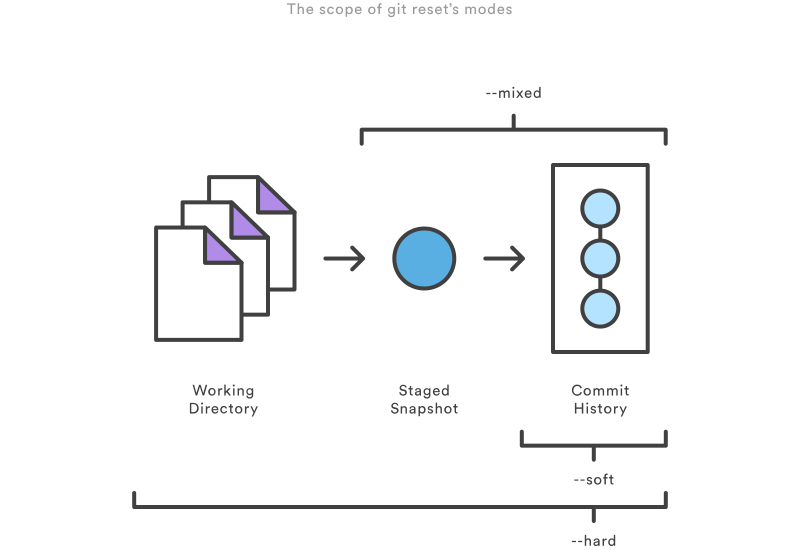

git log --pretty=oneline

#### Git 工作区、暂存区和版本库

基本概念
我们先来理解下Git 工作区、暂存区和版本库概念

工作区：就是你在电脑里能看到的目录。
暂存区：英文叫stage, 或index。一般存放在 ".git目录下" 下的index文件（.git/index）中，所以我们把暂存区有时也叫作索引（index）。
版本库：工作区有一个隐藏目录.git，这个不算工作区，而是Git的版本库。
下面这个图展示了工作区、版本库中的暂存区和版本库之间的关系：
远程版本库：git push 将本地版本库变更推送到远程仓库


图中左侧为工作区，右侧为版本库。在版本库中标记为 "index" 的区域是暂存区（stage, index），标记为 "master" 的是 master 分支所代表的目录树。

图中我们可以看出此时 "HEAD" 实际是指向 master 分支的一个"游标"。所以图示的命令中出现 HEAD 的地方可以用 master 来替换。

图中的 objects 标识的区域为 Git 的对象库，实际位于 ".git/objects" 目录下，里面包含了创建的各种对象及内容。

当对工作区修改（或新增）的文件执行 "git add" 命令时，暂存区的目录树被更新，同时工作区修改（或新增）的文件内容被写入到对象库中的一个新的对象中，而该对象的ID被记录在暂存区的文件索引中。

当执行提交操作（git commit）时，暂存区的目录树写到版本库（对象库）中，master 分支会做相应的更新。即 master 指向的目录树就是提交时暂存区的目录树。

当执行 "git reset HEAD" 命令时，暂存区的目录树会被重写，被 master 分支指向的目录树所替换，但是工作区不受影响。

当执行 "git rm --cached <file>" 命令时，会直接从暂存区删除文件，工作区则不做出改变。

当执行 "git checkout ." 或者 "git checkout -- <file>" 命令时，会用暂存区全部或指定的文件替换工作区的文件。这个操作很危险，会清除工作区中未添加到暂存区的改动。

当执行 "git checkout HEAD ." 或者 "git checkout HEAD <file>" 命令时，会用 HEAD 指向的 master 分支中的全部或者部分文件替换暂存区和以及工作区中的文件。这个命令也是极具危险性的，因为不但会清除工作区中未提交的改动，也会清除暂存区中未提交的改动。

#### 常用git stash命令：

`git stash`用于想要保存当前的修改,但是想回到之前最后一次提交的干净的工作仓库时进行的操作.`git stash`将本地的修改保存起来,并且将当前代码切换到`HEAD`提交上.

（1）git stash save "save message"  : 执行存储时，添加备注，方便查找，只有git stash 也要可以的，但查找时不方便识别。

（2）git stash list  ：查看stash了哪些存储

（3）git stash show ：显示做了哪些改动，默认show第一个存储,如果要显示其他存贮，后面加stash@{$num}，比如第二个 git stash show stash@{1}

（4）git stash show -p : 显示第一个存储的改动，如果想显示其他存存储，命令：git stash show  stash@{$num}  -p ，比如第二个：git stash show  stash@{1}  -p

（5）git stash apply :应用某个存储,但不会把存储从存储列表中删除，默认使用第一个存储,即stash@{0}，如果要使用其他个，git stash apply stash@{$num} ， 比如第二个：git stash apply stash@{1} 

（6）git stash pop ：命令恢复之前缓存的工作目录，将缓存堆栈中的对应stash删除，并将对应修改应用到当前的工作目录下,默认为第一个stash,即stash@{0}，如果要应用并删除其他stash，命令：git stash pop stash@{$num} ，比如应用并删除第二个：git stash pop stash@{1}

（7）git stash drop stash@{$num} ：丢弃stash@{$num}存储，从列表中删除这个存储

（8）git stash clear ：删除所有缓存的stash


用Git进行多人协作开发时，必然会合并代码，解决冲突。然而合并代码也是需要点技巧的，如果对一些关键命令没有理解去使用的话，git的版本演进路线就会变得很乱，从而造成了日后维护的一些麻烦。

Git上合并代码有git merge 以及 git rebase 两种方式。下面将深入两者的用法以及对两者的适用场景作个总结。

##### 前置知识点

- Master分支：首先，代码库应该有一个、且仅有一个主分支。所有提供给用户使用的正式版本，都在这个主分支上发布。这个分支被称为Master分支；
- Develop分支：主分支只用来分布重大版本，日常开发应该在另一条分支上完成。我们把开发用的分支，叫做Develop分支。这个分支可以用来生成代码的最新隔夜版本（nightly）。如果想正式对外发布，就在Master分支上，对Develop分支进行"合并"（merge）。
- 临时性分支：除了常设分支以外，还有一些临时性分支，用于应对一些特定目的的版本开发。临时性分支主要有三种：　　　　
  - 功能（feature）分支：它是为了开发某种特定功能，从Develop分支上面分出来的。开发完成后，要再并入Develop。它的命名，可以采用feature-*的形式。
  - 预发布（release）分支：它是指发布正式版本之前（即合并到Master分支之前），我们可能需要有一个预发布的版本进行测试。预发布分支是从Develop分支上面分出来的，预发布结束以后，必须合并进Develop和Master分支。它的命名，可以采用release-*的形式。
  - 修补bug分支：软件正式发布以后，难免会出现bug。这时就需要创建一个分支，进行bug修补。修补bug分支是从Master分支上面分出来的。修补结束以后，再合并进Master和Develop分支。它的命名，可以采用fixbug-*的形式。

有了以上知识点，我们可以了解一般团队开发都是基于feature分支进行开发，然后把feature分支合并到develop分支的。接着我们模拟如下一个实际开发场景。

##### 场景

现在在develop开发分支上，然后你创建了一个feature分支开发新功能，现在团队中另一个成员在develop分支上添加了新的提交。如下图所示


现在，如果develop中新的提交和你的工作是相关的。为了将新的提交并入你的分支，你有两个选择：merge或rebase。


##### 采用merge
git merge
将develop分支合并到feature分支最简单的办法就是用下面这些命令：

```
git checkout feature
git merge develop 
```
或者，你也可以把它们压缩在一行里。(个人还是喜欢上面的写法)

```
git merge develop feature
```
feature分支中新的合并提交(merge commit)将两个分支的历史连在了一起。你会得到下面这样的分支结构：

Merge好在它是一个安全的操作。现有的分支不会被更改，避免了rebase潜在的缺点(后文会讲)。但是这同样意味着每次合并上游更改时feature分支都会引入一个外来的合并提交。如果master非常活跃的话，这或多或少会污染你的分支历史。


git merge --no-ff
默认情况下，Git执行"快进式合并"（fast-farward merge），会直接将develop分支指向feature分支。如git merge里的图所示。使用--no-ff参数后，会执行正常合并，在develop分支上生成一个新节点。为了保证版本演进的清晰，我们希望采用这种做法。关于合并的更多解释，请参考Benjamin Sandofsky的《Understanding the Git Workflow》。


可以看到，使用了git merge --no-ff 命令后的git 演进路线是清晰的，命令概括如下：

```
git checkout feature
git merge --no-ff develop
```
git merge --no-ff 在每次合并都会产生一个新的合并记录; 
git merge 的话只有解决冲突的时候才会产生一个新的合并记录。

##### 采用git rebase
先提个问题吧，git rebase 和 git reset 有什么区别？ 如果不知道的话，可以在回顾一下在什么场景下用git merge以及git rebase的，而git reset则仅仅是在当前的分支(一个分支)的版本切换。

接着来讲git rebase。作为merge的替代选择，你可以像下面这样将feature分支并入develop分支：

```
git checkout feature
git rebase develop
```
它会把整个feature分支移动到develop分支的后面，有效地把所有develop分支上新的提交并入过来。但是，rebase为原分支上每一个提交创建一个新的提交，重写了项目历史，并且不会带来合并提交。


rebase最大的好处是你的项目历史会非常整洁。首先，它不像git merge 那样引入不必要的合并提交。其次，如上图所示，rebase导致最后的项目历史呈现出完美的线性。这让你更容易使用git log来查看项目历史。

不过，这种简单的提交历史会带来两个后果：安全性和可跟踪性。如果你违反了rebase黄金法则，重写项目历史可能会给你的协作工作流带来灾难性的影响。此外，rebase不会有合并提交中附带的信息——你看不到feature分支中并入了上游的哪些更改。

> git merge --no-ff 在每次合并都会产生一个新的合并记录; git merge 的话只有解决冲突的时候才会产生一个新的合并记录。

rebase的黄金法则
当你理解rebase是什么的时候，最重要的就是什么时候 不能 用rebase。git rebase 的黄金法则便是，绝不要在公共的分支上使用它。

比如说，如果你在develop分支上，rebase到你的feature分支上会发生什么：


这次rebase将develop分支上的所有提交都移到了feature分支后面。问题是它只发生在你的代码仓库中，其他所有的开发者还在原来的develop上工作。因为rebase引起了新的提交，Git会认为你的develop分支和其他人的develop已经分叉了。

同步两个develop分支的唯一办法是把它们merge到一起，导致一个额外的合并提交和两堆包含同样更改的提交。不用说，这会让人非常困惑。

所以重要的再强调一遍，绝不要在公共的分支上使用它。在你运行git rebase 之前，一定要问问你自己“有没有别人正在这个分支上工作？”。如果答案是肯定的，重新找到一个无害的方式（如git revert）来提交你的更改。不然的话，你可以随心所欲地重写历史。

如果你想要一个干净的、线性的提交历史，没有不必要的合并提交，你应该使用git rebase 而不是git merge 来并入其他分支上的更改。

另一方面，如果你想要保存项目完整的历史，并且避免重写公共分支上的commit， 你可以使用git merge (--no-ff)。

#### reset |checkout|revert
git reset, git checkout, git revert 命令是最有用的三条 git 命令。他们可以帮助你撤销 repo 的一些操作，并且前两条命令既可以用于 commit 级别，也可以用于 file 级别。

因为他们很相似，所以很容易混淆。这片文章，我们将比较他们的相同和不同之处。
阅读本文前需要了解 git repo 的三大 components，分别是 working directory(代码仓库)  staged snapshot(快照:add的缓存库) commit history(commit历史) ，这将更好的帮助你理解这三条命令。


commit 级别的操作
传递给 git reset 和 git checkout的参数会决定命令的作用范围。当命令并不包括含一个文件路径时，命令作用于整个 commit。

###### reset
在 commit 级别上，git reset 命令移动 HEAD 到当前分支的一个 commit， 这可以用来撤销当前分支的一些 commit 。
例如，下面的命令会让 ｀hotfix｀ 分支回退两个 commits

```
git checkout hotfix
git reset HEAD~2
```
先前在 HEAD 之前的两次 commit 现在处在 HEAD 之后，这意味着他们在下一次 git 提交时被作为垃圾删掉，换句话说这两次提交会被抛弃。如下图所示：


git reset用于撤销未被提交到远端的改动。除了可以移动当前分支的HEAD，你可以通过不同的标记选择修改 staged snapshot 或者 working directory

--soft： staged snapshot 和 working directory 都未被改变 (建议在命令行执行后，再输入 git status 查看状态)
--mixed： staged snapshot 被更新， working directory 未被更改。【这是默认选项】（建议同上)
--hard： staged snapshot 和 working directory 都将回退。
--hard 很危险，它会直接回退你之前所有的修改，使用前，可以事先保存 commit id.



【这些标记经常和HEAD一起使用。例如，git reset --mixed HEAD可撤销所有缓存改动，但是保留他们在工作目录下。git reset --hard HEAD可彻底删除没有提交的改动。】

 

###### checkout

到现在为止，你应该已经熟悉 `commit` 级别的 `git checkout` 了。当你传送一个 `branch name` 名字时,你将更换当前的分支.

```
git checkout hotfix
```

上面的命令会切换 HEAD 到不同的分支，并且更新当前的 `working directory` 去匹配。因为会覆盖当前的本地更改，所以更换分支前`git`强制你彻底放弃或者提交存储当前的更改。不同于 `git reset`, `git checkout` 不会废弃任何分支或提交。


你也可以 checkout 到任何一次 commit，通过提供 commit Id 作为参数.

比如下面的命令。

```
git checkout HEAD~2/[commit id]
```


这对于 review repo 的某个 version 的代码很有用。然而，如果再次添加新的提交就无法返回原先的状态。因此，你应该在修改前总是创建一个新的分支。

###### revert
git revert 命令通过创建一次新的 commit 来撤销一次 commit 所做出的修改。这种撤销的方式是安全的，因为它并不修改 commitm history, 比如下边的命令将会查出倒数第二次（即当前commit的往前一次）提交的修改，并创建一个新的提交，用于撤销当前提交的上一次 commit。

```
git checkout hotfix
git revert HEAD~2
```

如下图所示：


##### File 级别的操作
git reset 和 git checkout 命令同样可以接受一个可选的文件路径作为参数,这样可以将操作限制在一个单独的文件中。


###### reset:

当调用一个文件路径时，`git reset` 命令会更新 `staged snapshot` 去匹配某次 `commit`。 下面的命令将会使文件回退一个 `commit`。
```
git reset HEAD~1 ［文件］（不建议使用）
```


【--soft、--mixed、--hard标记此时不起作用，会更新staged snapshot，但不更新working directory】

###### checkout
git checkout 命令 和 git reset 类似，除了它会更新 working directory, 而不是  staged snapshot
如下命令将会更新 working directory 去匹配某次 commit

```
git checkout HEAD~1 [文件]
```
